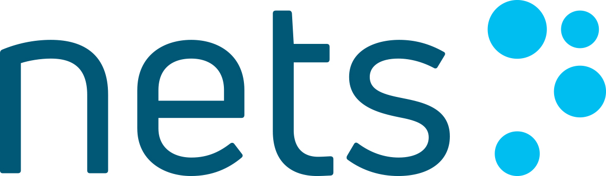

# PiA - Netaxept iOS SDK v1.2.0



## Getting started

PiA Netaxept iOS SDK is a library that provides the native in-app interactions to accept payments with Netaxept directly from native iOS apps while minimizing PCI DSS requirements for you.

PiA - Netaxept Mobile SDK Android can be found [here](https://github.com/Nets-mobile-acceptance/Netaxept-Android-SDK).

|   |  |
| --- | --- |

## Sample Project

We have provided a sample project, PiaSample, in the repository which is written in Swift 4 and it demonstrates Pia usage and capabilities. To use it download the repo, run **pod install** to download the required libraries and open **PiaSample.xcworkspace**. Then, delete the libs folder with everything in it and follow one of the installation types from below to add **Pia.framework**, either [manual installation](#manually) steps or [Carthage](#carthage). After that, navigate to **ConstantAPI.swift** to add your Merchant Backend URLs and Netaxept Merchant IDs.

## Project status
Supported payment methods:
* Cards: Visa, Mastercard, American Express, Diners, JCB, Dankort
* Apple Pay
* PayPal
* Nordic mobile wallets (Vipps, Swish, MobilePay) – *available soon*

## Requirements
* PiA iOS SDK requires iOS 9 or above.
* Card scanning functionality requires *Camera Permission*, the camera usage must be added to *Info.plist* file in the host application.

```
Key    :  Privacy - Camera Usage Description   
Value  :  $(PRODUCT_NAME) camera us
```

## Installation
### Carthage
**NOTE: If this is the first time you are using Carthage, please refer to this [guide](https://github.com/Carthage/Carthage#adding-frameworks-to-an-application) for correct installation.**

If you do not have Carthage yet, refer to this [link](https://github.com/Carthage/Carthage) for complete instruction from Carthage.

* Make the following entry in your Cartfile:

```
github "Nets-mobile-acceptance/Netaxept-iOS-SDK"
```

* Run `carthage update`.
* Go inside your project's folder in Carthage/Checkouts/Netaxept-iOS-SDK and unzip PiaSDKFramework.zip.
* Go to your project's target General tab and drag the Pia.framework into the Linked Frameworks and Libraries section.
* Add Pia.framework to Embedded Binaries from the General tab.


### Manually
* Download/clone this https://github.com/Nets-mobile-acceptance/Netaxept-iOS-SDK.git
* Unzip **PiaSDKFramework.zip** to obtain **Pia.framework**.
* Drag and drop **Pia.framework** to your project.
* Go to your project target at Build Phases.
* Add Pia.framework to Link Binary With Libraries.
* Add Pia.framework to Embedded Binaries from the General tab.

### NOTE
Because of enabling Bitcode, the framework size exceeds the 100MB limit of GitHub uploading policy.

One option is to use Carthage for automated installation.

Alternatively, if you wish to install the SDK manually, please refer to the following walk-around for uploading to GitHub:
1. Add "Pia.framework" to your **.gitignore** list
2. Use [GitHub large file system](https://git-lfs.github.com/) to continue uploading framework within your working project

## Frequently Asked Questions
If you encounter any blockers when integrating the `Netaxept - iOS SDK`, feel free to check the [Frequently Asked Questions](FAQs.md) page. If any of these answers does not fit your question, don't hesitate to [contact us](#contact).

## Usage
After setup is ready, using PiA SDK is easy. For full references, please refer to **Documentation** folder.

### Normal Payment Flow - Use this flow for card payments

```swift
let piaSDK = PiaSDKController(merchantInfo: merchantInfo, orderInfo:orderInfo)
piaSDK.piaDelegate = self
self.present(piaSDK, animated: true, completion: nil)
```
### Easy Payment Flow - Use this flow for returning users who previously saved their card information
```swift
let piaSDK = PiaSDKController(merchantInfo, orderInfo: orderInfo, tokenCardInfo: tokenCardInfo)
piaSDK.piaDelegate = self
self.present(piaSDK, animated: true, completion: nil)
```
### ApplePay flow - Use this flow to trigger Apple Pay payments
```swift
let applePayInfo = self.createApplePayInfo(amount: amount, currencyCode: currencyCode, usingExpressCheckout: true)
let piaSDK = PiaSDKController(applePayInfo: applePayInfo)
piaSDK.piaDelegate = self
self.present(piaSDK, animated: true,  completion: nil)
```

### Delegation
```swift
* func piaSDK(_ PiaSDK: PiaSDKController, didFailWithError error: NPIError)

* func piaSDKDidComplete(withSuccess PiaSDK: PiaSDKController)

* func piaSDKDidCompleteSaveCard(withSuccess PiaSDK: PiaSDKController)

* func piaSDKDidCancel(_ PiaSDK: PiaSDKController)
```
**NOTE:** If you wish to support Shipping Address with Apple Pay, remember to conform to this (optional) delegate.

```swift
func piaSDK(_ PiaSDKController: PiaSDKController, didChangeApplePayShippingContact contact: PKContact, withCompletion completionHandler: @escaping (Bool, NSDecimalNumber?) -> Void)
```

## Contact
If you have any question or feedback, please contact us via email: mobile-acceptance@nets.eu.

License
----

*****Copyright (c) 2019 Nets Denmark A/S*****


NETS DENMARK A/S, ("NETS"), FOR AND ON BEHALF OF ITSELF AND ITS SUBSIDIARIES AND AFFILIATES UNDER COMMON CONTROL, IS WILLING TO LICENSE THE SOFTWARE TO YOU ONLY UPON THE CONDITION THAT YOU ACCEPT ALL OF THE TERMS CONTAINED IN THIS BINARY CODE LICENSE AGREEMENT. BY USING THE SOFTWARE YOU ACKNOWLEDGE THAT YOU HAVE READ THE TERMS AND AGREE TO THEM. IF YOU ARE AGREEING TO THESE TERMS ON BEHALF OF A COMPANY OR OTHER LEGAL ENTITY, YOU REPRESENT THAT YOU HAVE THE LEGAL AUTHORITY TO BIND THE LEGAL ENTITY TO THESE TERMS. IF YOU DO NOT HAVE SUCH AUTHORITY, OR IF YOU DO NOT WISH TO BE BOUND BY THE TERMS, YOU MUST NOT USE THE SOFTWARE ON THIS SITE OR ANY OTHER MEDIA ON WHICH THE SOFTWARE IS CONTAINED.

Software is copyrighted. Title to Software and all associated intellectual property rights is retained by NETS and/or its licensors. Unless enforcement is prohibited by applicable law, you may not modify, decompile, or reverse engineer Software.

No right, title or interest in or to any trademark, service mark, logo or trade name of NETS or its licensors is granted under this Agreement.

Permission is hereby granted, to any person obtaining a copy of this software and associated documentation files (the Software"), to deal in the Software, including without limitation the rights to use, copy, publish, distribute, sublicense, and/or sell copies of the Software, and to permit persons to whom the Software is furnished to do so, subject to the following conditions:

The above copyright notice and this permission notice shall be included in all copies or substantial portions of the Software.

Software may only be used for commercial or production purpose together with Netaxept services provided from NETS, its subsidiaries or affiliates under common control.

THE SOFTWARE IS PROVIDED "AS IS", WITHOUT WARRANTY OF ANY KIND, EXPRESS OR IMPLIED, INCLUDING BUT NOT LIMITED TO THE WARRANTIES OF MERCHANTABILITY, FITNESS FOR A PARTICULAR PURPOSE AND NONINFRINGEMENT. IN NO EVENT SHALL THE AUTHORS OR COPYRIGHT HOLDERS BE LIABLE FOR ANY CLAIM, DAMAGES OR OTHER LIABILITY, WHETHER IN AN ACTION OF CONTRACT, TORT OR OTHERWISE, ARISING FROM, OUT OF OR IN CONNECTION WITH THE SOFTWARE OR THE USE OR OTHER DEALINGS IN THE SOFTWARE.
