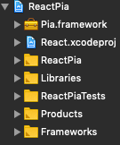
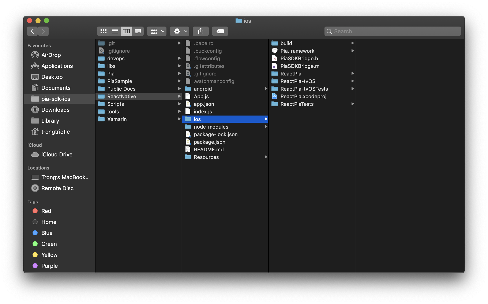

#React Native iOS Integration Guide

This is a reference source code of an application (under MIT license) using the SDK, provided for demo purpose!

This guide is intended to help you integrate PiA - Netaxept iOS SDK within your React Native project fast and easy.

## Pre-requisites
* Installed [XCode](https://developer.apple.com/xcode/).
* Have some basic knowledge of either Swift or Objective-C.
* Had **Pia.framework** already. If not, please refer to this _[link](https://github.com/Nets-mobile-acceptance/Netaxept-iOS-SDK)_ for instruction.

## Overview
* Objective-C step-by-step instruction
* Swift step-by-step instruction
* NOTE

## Objective-C step-by-step instruction
1. Navigate to your React Native project folder, under iOS folder, open `[YOUR PROJECT NAME].xcodeproj`
2. Drag and drop **Pia.framework** to your project hierarchy (see an example below).

1. Within your project hierarchy, navigate to your main project folder (which includes files like AppDelegate.m, AppDelegate.h, main.m)
2. Right click and choose **New File...**
3. From the template, choose **Cocoa Touch Class**
4. Name your new class with your desire name, choose subclass as **NSObject** and language to **Objective-C**
5. Open your new created header file (named like `[YOUR DESIRE NAME].h`)
6. Add the following lines of code to your header file

```objective-c
#import <React/RCTBridgeModule.h>
#import "Pia.framework/Headers/Pia.h"
```
```objective-c
<RCTBridgeModule, PiaSDKDelegate>
```

## Swift step-by-step instruction
1. Navigate to your React Native project folder, under iOS folder, open `[YOUR PROJECT NAME].xcodeproj`
2. Drag and drop **Pia.framework** to your project hierarchy (see an example below).

1. Within your project hierarchy, navigate to your main project folder (which includes files like AppDelegate.m, AppDelegate.h, main.m)
2. Right click and choose **New File...**
3. From the template, choose **Cocoa Touch Class**
4. Name your new class with your desire name, choose subclass as **NSObject** and language to **Swift**
5. From the popup "Would you like to configure an Objective-C bridging header?", choose **Create Bridging Header**
6. Open your `[YOUR PROJECT NAME]-Bridging-Header.h`, and add this line of code `#import <React/RCTBridgeModule.h>`
7. Open your new created swift file (named like `[YOUR DESIRE NAME].swift`)
8. Add the following lines of code to your swift file

```swift
import Pia
```
```swift
PiaSDKDelegate
```

## Using PiA within your React Native project
In your `[YOUR DESIRE NAME].m`, start exposing SDK functionalities to React Native by adding following keyword `RCT_EXPORT_METHOD`


```objective-c
RCT_EXPORT_METHOD(callPiaWithPayPal:(RCTResponseSenderBlock)callback) {
  NPIMerchantInfo *merchantInfo = [[NPIMerchantInfo alloc] initWithIdentifier:@"YOUR_MERCHANT_ID_HERE"];
  PiaSDKController *controller = [[PiaSDKController alloc] initForPayPalPurchaseWithMerchantInfo:merchantInfo];
  controller.PiaDelegate = self;
  
  [[UIApplication sharedApplication].delegate.window.rootViewController presentViewController:controller animated:YES completion:^{
    callback(@[[NSNull null], @"Yes"]);
  }];
}
```

and use that exposed method in your Javascript project.

```
var _PiaSDK = require('NativeModules').PiaSDKBridge;
_PiaSDK.callPiaWithPayPal((error, message))
```

## Recommendation
Since it is stated by Facebook that **callbacks** is not probably implemented and there is no clear best practices, the recommendations are:
* Synchronous networking call should be make inside bridge files (written in `Swift` or `Objective-C`, refer to sample project for more details)
* Only the final results should be sent back to `JavaScript` part, including Cancel case, Fail case with error messages or Successful case.

## NOTE
* If your choose Swift as your main language, remember to add `@objc` for your classes and methods because React Native is only working, at the moment, directly with Objective-C.
* PiA iOS SDK uses delegations and callbacks as the main interaction for sending datas as well as results. Therefore, for a better understanding of interaction between React Native and Native iOS, please refer to this _[link](https://facebook.github.io/react-native/docs/native-modules-ios)_

## Sample Project
We also provide an example project within the package, please refer to the project for more details.
In order to run the sample project, make sure:
* Download Pia.framework in advance
* Drag and drop Pia.framework to the top most of the iOS project directory like example image.

* Start using sample project.