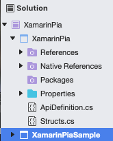

# Xamarin Integration Guide
This guided is intended to help you get up to speed and start implementing PiA - Netaxept iOS SDK right away.
## Step-by-step instruction
1. From your solution, right click and choose **Add** and then **Add New Project**

2. From the project Template, choose **Library** under **iOS** section and then choose **Binding Library**

3. After adding new Binding Library to your solution, you will get the similar structure


1. Navigate to your **Native References** folder, right click and choose **Add Native Reference**, from here choose the right place that contains Pia.framework
2. Open your `ApiDefinition.cs` and `Structs.cs`, replace the contents inside with these two files' contents. [ApiDefinition.cs](./Resources/ApiDefinition.cs) [Structs.cs](./Resources/Structs.cs)
3. Right click on your Binding Library solution and choose **Build [YOUR BINDING LIBRARY NAME]** to make sure everything is working as expected.

## Using new Binding Library with your project
1. From your project solution, right click on **Reference** folder and choose **Edit References...**
2. From the panel, navigate to **Projects** tab, check to include your new created Binding Library.
3. From any files that you want to use Binding Library, add the following line: `using [YOUR BINDING LIBRARY NAMESPACE];`

## Example usage
```c#
public override void ViewDidAppear(bool animated) {
    base.ViewDidAppear(animated);
    var merchantInfo = new NPIMerchantInfo("", true);
    var amount = new NSNumber(10);
    var orderInfo = new NPIOrderInfo(amount, "EUR");
    var controller = new PiaSDKController(orderInfo, merchantInfo);
    controller.PiaDelegate = new PiaXamarinDelegate();
    this.PresentViewController(controller, true, null);
}
```

```c#
public partial class PiaXamarinDelegate : PiaSDKDelegate {
        public override void DoInitialAPICall(PiaSDKController PiaSDKController, bool storeCard, Action<NPITransactionInfo> completionHandler)
        {
            var transactionInfo = new NPITransactionInfo("", "", "");
            completionHandler(transactionInfo);
        }

        public override void PiaSDK(PiaSDKController PiaSDKController, NPIError error)
        {
            throw new NotImplementedException();
        }

        public override void PiaSDK(PiaSDKController PiaSDKController, PKContact contact, Action<bool, NSDecimalNumber> completionHandler)
        {
            base.PiaSDK(PiaSDKController, contact, completionHandler);
        }

        public override void PiaSDKDidCancel(PiaSDKController PiaSDKController)
        {
            throw new NotImplementedException();
        }

        public override void PiaSDKDidCompleteSaveCardWithSuccess(PiaSDKController PiaSDKController)
        {
            throw new NotImplementedException();
        }

        public override void PiaSDKDidCompleteWithSuccess(PiaSDKController PiaSDKController)
        {
            throw new NotImplementedException();
        }

        public override void RegisterPaymentWithApplePayData(PiaSDKController PiaSDKController, PKPaymentToken paymentData, PKContact newShippingContact, Action<NPITransactionInfo> completionHandler)
        {
            throw new NotImplementedException();
        }

        public override void RegisterPaymentWithPayPal(PiaSDKController PiaSDKController, Action<NPITransactionInfo> completionHandler)
        {
            throw new NotImplementedException();
        }
}
```

## Sample project
1. Open `XamarinPia.sln`.
2. Navigate to the XamarinPia section on project hierarchy.
3. Right click on **Native References**.
4. Choose **Add Native Reference**.
5. Choose `Pia.framework` (refer to the instruction how to get Pia.framework).
6. Build your project and start using.